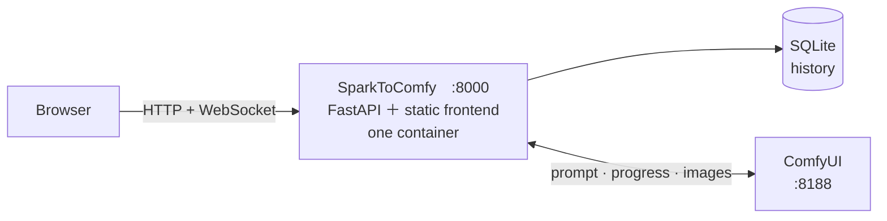

<p align="center">
  
</p>

<p align="center">
  <a href="#prerequisites">Prerequisites</a>
  ·
  <a href="#quick-start">Quick start</a>
  ·
  <a href="#configuration">Configuration</a>
  ·
  <a href="#add-a-workflow">Add a workflow</a>
  ·
  <a href="docs/README.zh-TW.md">繁體中文</a>
</p>

<p align="center">
  <strong>A front end that turns ComfyUI into an application.</strong><br>
  The parameter panel is driven by the backend and rendered dynamically by the frontend, so its order and its controls can change at any time.
</p>

<p align="center">
  
  
  
  
  <a href="LICENSE"></a>
</p>

---

SparkToComfy is a web front end that talks to the ComfyUI API.
It submits generations, shows the running state, the queue position and the progress, and records the parameters behind each image once the generation succeeds.

<p align="center">
  
  
</p>

<details>
<summary>More screens</summary>

Every history entry keeps the seed, size, steps, CFG, sampler, model, LoRAs and the full prompt.

<p align="center">
  
</p>

The LoRA picker

<p align="center">
  
</p>

</details>

## Architecture



| Method | Path | What it does |
| --- | --- | --- |
| `GET` | `/` | The frontend |
| `GET` | `/v1/workflows` | Every workflow and its parameters, as configured on the backend |
| `POST` | `/v1/generate` | Generate an image |
| `POST` | `/v1/jobs/{promptId}/cancel` | Cancel a queued or running job |
| `GET` | `/v1/jobs/{promptId}` | Where a job stands: queued, running, done or error |
| `GET` | `/v1/history` | This session's records, capped at 50 |
| `DELETE` | `/v1/history` | Delete every record belonging to this session, soft-deleted |
| `GET` | `/v1/images/{promptId}` | An output image; the backend proxies ComfyUI's `/view` API straight through |
| `GET` | `/v1/lora/cover` | LoRA cover art, fetched through Lora Manager |
| `WS` | `/v1/ws` | Real-time communication with the frontend |

## Prerequisites

A running ComfyUI, and a workflow.

### ComfyUI-Lora-Manager (optional)

Cover art comes from the Lora Manager API, so [`willmiao/ComfyUI-Lora-Manager`](https://github.com/willmiao/ComfyUI-Lora-Manager) is required if you want covers in the LoRA picker.

It can be left out when the workflow declares no `lora` control, or when a picker without cover images is good enough.

## Quick start

```bash
git clone https://github.com/Zhen-Bo/SparkToComfy.git
cd SparkToComfy
cp config/workflow.example.yaml config/workflow.yaml
docker compose up -d
```

## Local development

**Backend**

```bash
uv sync
cp config/workflow.example.yaml config/workflow.yaml
uv run uvicorn app.main:app --reload
```

**Frontend**

```bash
cd frontend
npm install
npm run dev
```

The Vite dev server already forwards the `/v1` API and the WebSocket to `127.0.0.1:8000`.

After changing a message type or status string in `app/ws/schemas.py`, regenerate the frontend contract:

```bash
uv run python scripts/gen_ws_contract.py
```

Forgetting this fails `tests/test_units.py`.

The API docs are off by default.
Turn them on for one run without editing the tracked config file:

```bash
SERVER__DOCS=true uv run uvicorn app.main:app --reload
```

## Configuration

`config/app.toml` is the only configuration file.

| Field | Default | Notes |
| --- | --- | --- |
| `server.host` | `0.0.0.0` | The host the application binds to |
| `server.port` | `8000` | The port the application binds to |
| `server.database` | `data/comfypanel.db` | Where the database lives |
| `server.docs` | `false` | Switch for `/docs`, `/redoc` and `/openapi.json` |
| `server.log_level` | `INFO` | Log verbosity; `DEBUG` also prints rejected prompts and invalid request bodies |
| `server.log_format` | `console` | `console` for people, `json` for a log collector, one object per line |
| `comfyui.url` | `http://127.0.0.1:8188` | Where the ComfyUI API runs |
| `eta.upscale_seconds_per_megapixel` | `0.7` | Extra wait factor for upscaling; calibrate it for your GPU and workflow |
| `rate_limit.enabled` | `false` | Whether rate limiting is on |
| `rate_limit.window_minutes` | `60` | Rate limit window length |
| `rate_limit.max_generations` | `20` | Generations per IP inside the window |

**Environment variables win over the TOML file.** The name is the section and the field joined by two underscores, upper case:

| TOML | Environment variable |
| --- | --- |
| `[server] docs` | `SERVER__DOCS` |
| `[comfyui] url` | `COMFYUI__URL` |
| `[rate_limit] enabled` | `RATE_LIMIT__ENABLED` |

> [!WARNING]
> An unknown field in `app.toml` stops the application from starting.

## Security

This version has no authentication at all.
Login and similar features will be added later.

The limits that exist today:

- **One job in flight per IP.**
  Always on, independent of `rate_limit`.
- **`rate_limit`.**
  Off by default.

## Add a workflow

Three files describe one workflow, and they refer to each other:

```text
config/
├── workflow.yaml           # registry: id → display name + the paths of the two files below
├── parameter/<id>.yaml     # the parameter form: what the panel shows, and which graph node each control writes to
└── workflow/<name>.json    # the ComfyUI graph, exported in API format
```

1. In ComfyUI, export the graph in **API format** (not the ordinary workflow JSON) and put
   it in `config/workflow/`.
2. Copy `config/parameter/example.yaml` and adapt it to the input controls your API needs.
3. Register the workflow in `config/workflow.yaml`, pointing at both files.

Workflows reload every 30 seconds, so editing the YAML and adding a workflow both need no restart.

## Testing

```bash
uv run pytest           # 75 tests, no ComfyUI needed
uv run pytest -m e2e    # 14 tests, needs a real ComfyUI
```

Lint and types:

```bash
uv run ruff check .
uv run ruff format --check .
uv run pyright
```

## License

[MIT](LICENSE) for the code.
The three bundled fonts are SIL OFL 1.1; the notice ships with the app at `/FONT-LICENSE.txt`.
