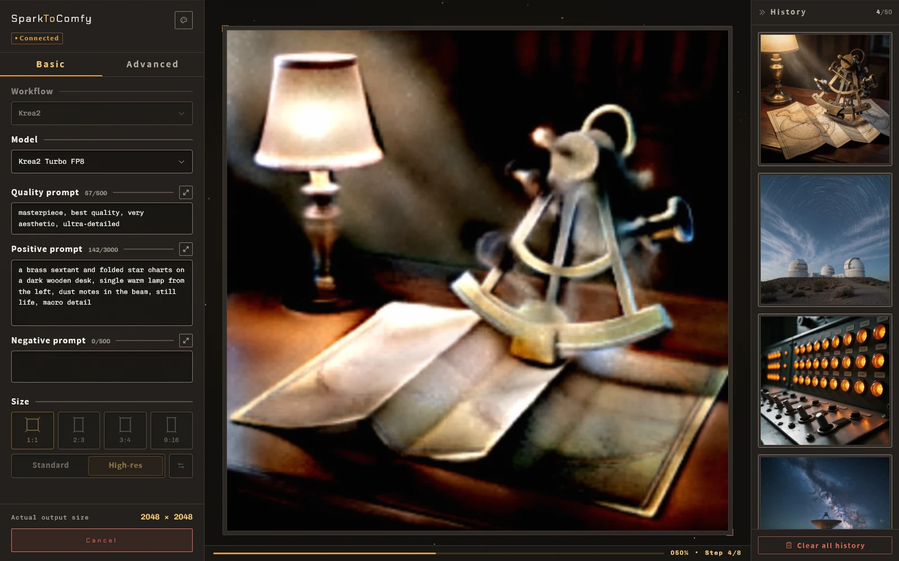
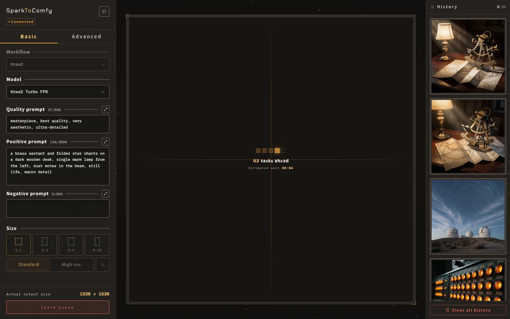
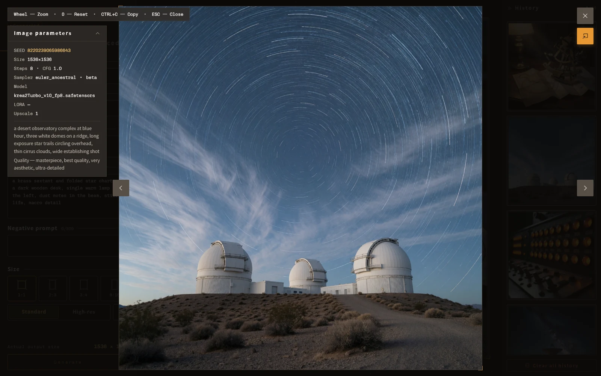
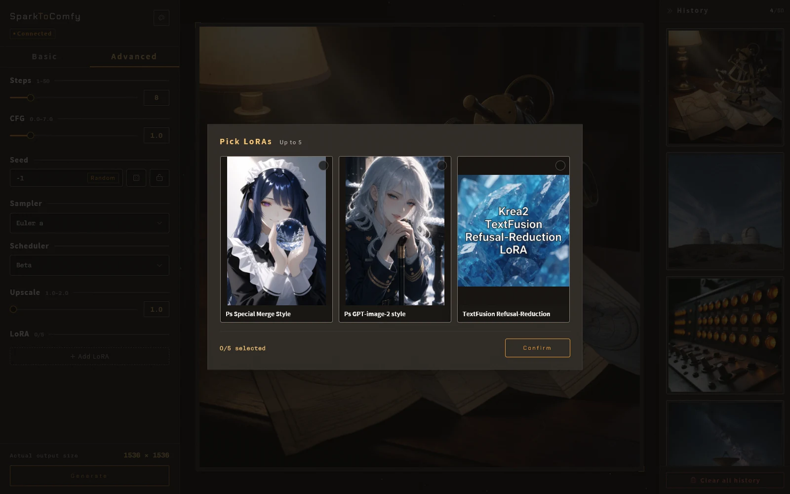
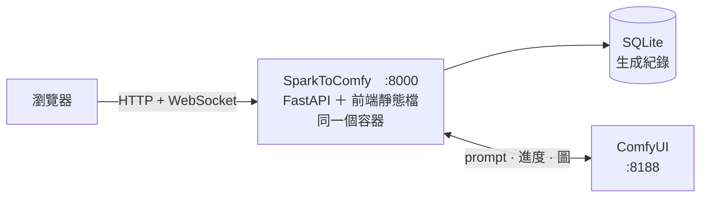

<p align="center">
  
</p>

<p align="center">
  <a href="#事前需求">事前需求</a>
  ·
  <a href="#快速開始">快速開始</a>
  ·
  <a href="#設定">設定</a>
  ·
  <a href="#加一個新工作流">加一個新工作流</a>
  ·
  <a href="../README.md">English</a>
</p>

<p align="center">
  <strong>一個將 ComfyUI 應用化的前端。</strong><br>
  參數面板由後端控制，前端動態顯示，隨時可以變更順序與種類。
</p>

<p align="center">
  
  
  
  
  <a href="../LICENSE"></a>
</p>

---

SparkToComfy 是一個串接 ComfyUI API 的網頁前端。
它可以送出生成、顯示執行中與佇列位置還有進度，同時在生成成功時記錄每張圖背後的參數。

<p align="center">
  
  
</p>

<details>
<summary>其他畫面</summary>

每一筆歷史紀錄都留著 seed、尺寸、步數、CFG、採樣器、模型、LoRA 和完整提示詞。

<p align="center">
  
</p>

LoRA 選擇器

<p align="center">
  
</p>

</details>

## 架構



| Method | 路徑 | 做什麼 |
| --- | --- | --- |
| `GET` | `/` | 前端 |
| `GET` | `/v1/workflows` | 取得後端設定的所有工作流和參數 |
| `POST` | `/v1/generate` | 生成圖像 |
| `POST` | `/v1/jobs/{promptId}/cancel` | 取消排隊中或生成中的工作 |
| `GET` | `/v1/history` | 取得這個 session 的生成紀錄，上限 50 筆 |
| `DELETE`  | `/v1/history` | 刪除屬於這個 session 的所有生成紀錄，軟刪除 |
| `GET` | `/v1/images/{promptId}` | 輸出圖，後端直接轉接 ComfyUI 的 `/view` API |
| `GET` | `/v1/lora/cover` | 透過 lora manager 取得 lora 封面圖 |
| `WS` | `/v1/ws` | 負責與前端即時通訊 |

## 事前需求

一個跑著的 ComfyUI，以及工作流。

### ComfyUI-Lora-Manager（選裝）

封面圖的 API 來自於 lora manager，想要 lora 選擇有封面的話必裝 [`willmiao/ComfyUI-Lora-Manager`](https://github.com/willmiao/ComfyUI-Lora-Manager)。

工作流沒有宣告 `lora` 控制項或是不介意 lora 選擇沒有圖片的時候可以不裝。

## 快速開始

```bash
git clone https://github.com/Zhen-Bo/SparkToComfy.git
cd SparkToComfy
cp config/workflow.example.yaml config/workflow.yaml
docker compose up -d
```

## 本機開發

**後端**

```bash
uv sync
cp config/workflow.example.yaml config/workflow.yaml
uv run uvicorn app.main:app --reload
```

**前端**

```bash
cd frontend
npm install
npm run dev
```

Vite dev server 已經設定把 `/v1` API 與 Websocket 轉發 `127.0.0.1:8000`。

改了 `app/ws/schemas.py` 裡的訊息型別或狀態字串，要重跑 codegen：

```bash
uv run python scripts/gen_ws_contract.py
```

忘了跑的話 `tests/test_units.py` 會出錯。

API 文件預設是關的。
不想動到版控裡的設定檔，就只針對這一次啟動打開：

```bash
SERVER__DOCS=true uv run uvicorn app.main:app --reload
```

## 設定

`config/app.toml` 是唯一設定檔。

| 欄位 | 預設 | 說明 |
| --- | --- | --- |
| `server.host` | `0.0.0.0` | 應用預設 host |
| `server.port` | `8000` | 應用預設 port |
| `server.database` | `data/comfypanel.db` | 資料庫所在的位置 |
| `server.docs` | `false` | 控制 `/docs`、`/redoc`、`/openapi.json` 開關 |
| `server.log_level` | `INFO` | 日誌等級；`DEBUG` 會多印被拒絕的 prompt 與無效的請求內容 |
| `server.log_format` | `console` | `console` 給人看，`json` 給日誌收集器，一行一個物件 |
| `comfyui.url` | `http://127.0.0.1:8188` | ComfyUI API 運行位置 |
| `eta.upscale_seconds_per_megapixel` | `0.7` | 圖片放大額外等待係數，須根據顯卡與工作流自行調整 |
| `rate_limit.enabled` | `false` | 是否開啟 rate limit |
| `rate_limit.window_minutes` | `60` | Rate limit 間隔時間 |
| `rate_limit.max_generations` | `20` | 單一 IP 在視窗內能生成幾次 |

**環境變數會蓋過 TOML。**
命名是「區段兩個底線欄位」，全大寫：

| TOML | 環境變數 |
| --- | --- |
| `[server] docs` | `SERVER__DOCS` |
| `[comfyui] url` | `COMFYUI__URL` |
| `[rate_limit] enabled` | `RATE_LIMIT__ENABLED` |

> [!WARNING]
> `app.toml` 裡出現不認識的欄位時回無法啟動應用。

## 安全性

當前版本沒有任何身分驗證。 後續會持續新增登入等等的功能。

目前的限制手段：

- **一個 IP 同時只有一個工作。**
  永遠開著，跟 `rate_limit` 無關。
- **`rate_limit`。**
  預設關閉。

## 加一個新工作流

牽涉三個檔案，它們互相對應：

```text
config/
├── workflow.yaml           # 註冊表：id → 顯示名稱 + 底下兩個檔案的路徑
├── parameter/<id>.yaml     # 參數表單：面板長什麼樣、每個控制項寫進圖上哪個節點
└── workflow/<name>.json    # ComfyUI 匯出的 API 格式流程圖
```

1. 在 ComfyUI 裡把流程圖存成 **API 格式**（不是一般的工作流 JSON），放進 `config/workflow/`。
2. 複製 `config/parameter/example.yaml` 改成你 API 的對應輸入選項。
3. 在 `config/workflow.yaml` 註冊，指到上面兩個檔案。

工作流每 30 秒自動重載，改 YAML 與新增 workflow 不需要重啟。

## 測試

```bash
uv run pytest           # 75 個，不需要 ComfyUI
uv run pytest -m e2e    # 14 個，需要真實的 ComfyUI
```

lint 與型別：

```bash
uv run ruff check .
uv run ruff format --check .
uv run pyright
```

## 授權

程式碼是 [MIT](../LICENSE)。
內建的三個字體是 SIL OFL 1.1，聲明跟著服務走，在 `/FONT-LICENSE.txt`。
